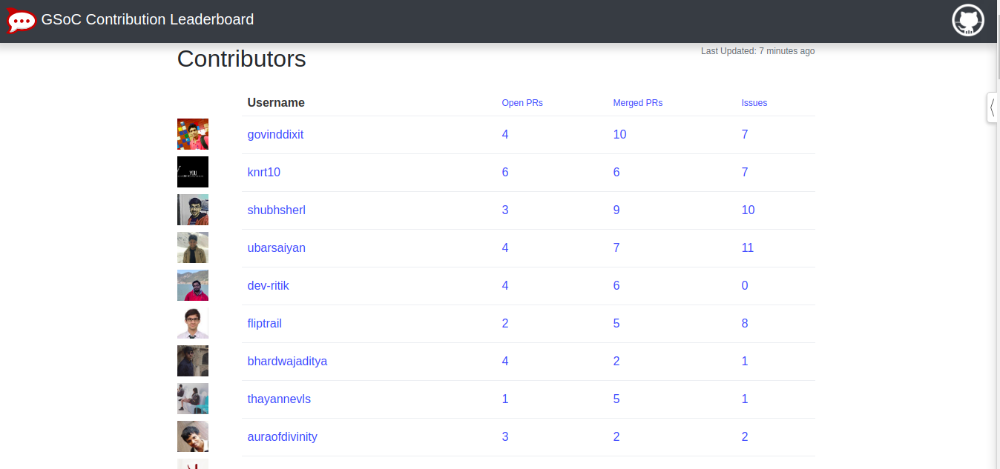

# GSoC Contributions Leaderboard



A contributions leaderboard for your GSoC organization. Students can track their position on leaderboard based on the PRs, commits, and issues they've completed across the repositories of your organization on Github.  Proudly created and maintined by the GSoC 2019 students and the [Rocket.chat community](https://github.com/RocketChat/Rocket.Chat).

## Benefits
- Encourage students to improve their position - by increasing contribution to your organization
- Easy to setup and administer
- Realtime organization-wide visibility to top student candidates

## Main Features
- Track commits/PRs/issues for GSoC student candidates in real time
- At a glance view of participating top students
- Easy administration to add students (even before they have made their very first contribution)
- Ability to Sort in descending order by Open, Merged Pulls, and Issues.

## Quick Start

Clone the repository to your local machine:

```bash
git clone https://github.com/shubhsherl/GSoC-Contribution-Leaderboard.git
```

Create a `python3` virtual environment, activate it and install the required packages
```
bash
virtualenv venv -p python3
source venv/bin/activate
pip install -r requirements.txt
```

Create a file name `.env` in the base directory (alongside manage.py) and
Add your Github Auth Token and Organization name in it as following

```
ORGANIZATION=''
ORGANIZATION_LOGO=''
ORGANIZATION_SITE=''
GITHUB_AUTH_TOKEN=''
DEFAULT_SORT=''
SHOW_RANK=''
```

Apply database migrations
```bash
python manage.py migrate
```

Finally, run the development server

```bash
python manage.py runserver
```

To run it in background and serve on any port (eg. 3003)
```bash
nohup python manage.py runserver 0.0.0.0:3003 &
```
(For production use follow a proper method for deploying a django app in production)

To create an admin user run
```bash
python manage.py createsuperuser
```

Start the refresh script

### Default Sort

The default sort weight only open and merged pulls, for [Rocket.Chat](https://gsoc.rocket.chat) we found this worked best for our student community.    You can flexibly change this multi-fields sort order by modifying the `.env` file.

Environment variable to change for default sort order:

`DEFAULT_SORT` 

This variable is used for ranking.  It is encoded as:

Value                           |  Metrics
--------------------------------|----------------------------------------------------------------
1 | Open Pulls
2 | Merged Pulls
4 | Issues

Add the values to combine the metrics.   For example: To include Open and Merged Pulls set `DEFAULT_SORT=3`. To include Merged Pulls and Issues set `DEFAULT_SORT=6`


###  Architecture

- The refresh script fetches contributions of users marked as GSoC candidates to selected repositories.
- A superuser/admin must mark the users as GSoC candidates, and can choose to not use certain repositories for counting contributions.
- Both the django application and the refresh script run on seperate threads.

###  Running the refresh script

`nohup sh refresh.sh &`

#### Initiailization:  First steps

- `python manage.py refresh` to sync your db with the latest repositories from your Organization.
- Visit `/admin`, mark the Repositories from which you want to count contributions.
- `python manage.py refresh` to fetch the contributors from Marked Repositories.
- Mark/Add users as GSoC contributors under Core>Users form the admin panel.


##### Admin levels:
- **Exclude Repo:** Decide which Repo to count for LeaderBoard
- **Moderator:** The above plus the ability to add/remove users

## Description of files in Repository

Non-Python files:

filename                           |  description
----------------------------------|------------------------------------------------------------------------------------
README.md                         |  Text file (markdown format) description of the project.
requirement.txt                   |  list all packages that needs to be installed for the project.
\*.html                           |  html file for rendering web-page

Python scripts files:

filename                           |  description
----------------------------------|------------------------------------------------------------------------------------
model.py                          |  Contains the Model for database.
admin.py                          |  Contains the Admin Model for Administrator dashboard.
view.py                           |  Fetch data from the Github database to a local sqlite3 database.
setting.py                        |  Django file for settings of Project.


## Contributing

We welcome all contributions for any GSoC orgs, students, or community members. Feel free to contribute bug-fixes at any time. If you plan to contribute new features, utility functions or extensions, please first create an issue and discuss the feature with us. Please help us to improve our documentation, including this page!

### Some suggested  features to add
- Add `Lines Added/Deleted` stats.
- Show personalized chart of commits/issues/PRs
- Add Register option for User
